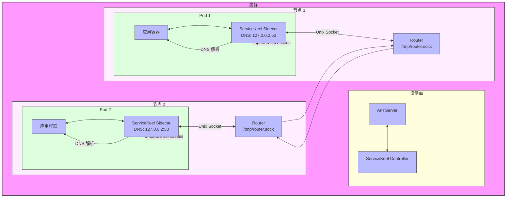

# 边缘环境下基于 Pod 注解的服务注册与发现机制

## 一、背景与动机

在边缘计算场景中，节点常常处于网络不可达或弱连接状态，导致 Kubernetes 原生的基于 API Server 的服务注册与发现机制无法正常工作。
为实现边缘自治，保障服务间通信，我们需要一种在本地也能运行的轻量级服务注册与发现方案。

我们借鉴 Kubernetes KEP-1645（Multi-Cluster Services API）中服务导出（Export）与导入（Import）的概念，
在边缘环境下采用声明式配置（例如 Pod 注解、ConfigMap）作为服务注册与发现信息的载体的一种方式，从而绕过中心化控制面依赖，增强系统的自治能力。Sidecar 通过监听和读取这些配置对应的本地文件来获取服务信息。

## 二、总体设计思路

本设计提出以下关键机制：

- 服务注册：根据 Service selector，将应导出的服务信息（包含命名空间、集群信息和协议类型）通过自动化方式（例如 Controller 写入 Pod 注解或 ConfigMap）提供给 Sidecar 容器内的指定文件（通常在 `/etc/servicekeel/` 目录下）。
- 服务导入：用户通过声明式配置（例如在 Pod 注解或 ConfigMap 中）指定该 Pod 需要访问的服务，这些配置被挂载到 Sidecar 容器内的指定文件（通常在 `/etc/servicekeel/` 目录下）供 Sidecar 读取，可指定 namespace、cluster 和协议类型。
- 边缘代理 Sidecar：读取 `/etc/servicekeel` 目录下挂载的配置文件，完成服务注册与发现的本地逻辑，支持不同协议（TCP/UDP）的处理。

## 三、关键定义

为了在 Kubernetes 资源中携带服务配置信息，ServiceKeel 约定使用以下键名。这些键值对可以通过 Pod 注解、ConfigMap 等方式提供，并通常通过 Volume 机制挂载到 Sidecar 容器的 `/etc/servicekeel` 目录下作为配置文件供 Sidecar 读取：

- `servicekeel.io/exported-services`：表示该 Pod 所需注册的服务列表，通常由 Service selector 决定并由自动化工具注入到 `/etc/servicekeel/exported-services-config.yaml` 等对应的配置文件中。
- `servicekeel.io/imported-services`：表示该 Pod 需访问的服务列表，由用户或自动化工具指定并注入到 `/etc/servicekeel/imported-services-config.yaml` 等对应的配置文件中。

这些配置文件的格式统一为 YAML 序列化的字符串，例如：

```yaml
services:
  - cluster: cluster-a.local
    name: simple-server
    namespace: default
    ports:
      - name: tcp
        port: 8080
        protocol: TCP
        targetport: 8080
      - name: ntp
        port: 123
        protocol: UDP
        targetport: 123
```


### 3.1 端口配置说明

每个服务的端口配置包含以下字段：
- `name`：端口名称，用于标识用途（如 tcp、ntp 等）
- `port`：服务对外暴露的端口
- `targetport`：容器内部实际监听的端口
- `protocol`：传输协议，支持 "TCP" 或 "UDP"

## 四、设计细节



### 4.1 服务注册流程

1. Controller 监听 Service 与 Pod 变更。
2. 判断 Service 的 selector 是否匹配某个 Pod。
3. 若匹配，将服务信息（包括协议类型）添加到 Pod 的 `servicekeel.io/exported-services` 注解中。

### 4.2 服务导入流程

1. 用户可直接在 Pod spec 中通过 `servicekeel.io/imported-services` 注解声明所需访问的服务。
2. Sidecar 负责将导出服务注册到 Router，根据服务信息配置相应的注册规则。
3. Sidecar 负责将导入服务建立为本地代理，根据服务信息配置相应的代理规则。

### 4.3 示例 YAML

```yaml
apiVersion: v1
kind: Pod
metadata:
  name: client
  namespace: default
  annotations:
    servicekeel.io/imported-services: |
      services:
        - cluster: cluster-a.local
          name: simple-server
          namespace: default
          ports:
            - name: tcp
              port: 8080
              protocol: TCP
              targetport: 8080
            - name: ntp
              port: 123
              protocol: UDP
              targetport: 123
spec:
  containers:
    - name: client
      image: nicolaka/netshoot:latest
      command:
        - sh
        - -c
        - |
          while true; do
            echo "Testing simple-server..."
            echo "TCP Test:"
            curl -s http://simple-server.default:8080/
            echo -e "\nUDP Test:"
            echo "test" | nc -u -w 1 simple-server.default 123
            sleep 5
          done
    - name: sidecar
      image: tkeelio/service-keel-sidecar:latest
      env:
        - name: SIDECAR_IP_RANGE
          value: "127.0.66.0/24"
        - name: SIDECAR_DNS_ADDR
          value: "127.0.0.2:53"
        - name: SIDECAR_SERVER_LISTEN
          value: "/tmp/router.sock"
```

[client-pod.yaml](../examples/simple/client-pod.yaml)
[server-pod.yaml](../examples/simple/server-pod.yaml)
[server-pod2.yaml](../examples/simple/server-pod2.yaml)


### 4.4 服务名称约定

- `<serviceName>`（必填）
- `<namespace>`（可选，默认当前 Pod 所在 namespace）
- `<cluster>`（可选，默认当前集群）

使用完整标识可确保跨集群唯一性。

## 五、系统组件说明

### 5.1 Sidecar

- 读取 `/etc/servicekeel` 目录下挂载的配置文件，例如 `exported-services-config.yaml` 和 `imported-services-config.yaml`；
- 实现本地 DNS 服务器，处理服务名称解析。
- 为导入服务建立代理，实现本地访问。
- 根据服务配置的协议类型（TCP/UDP）设置相应的代理规则。

主要功能：
1. DNS 服务（127.0.0.2:53）
   - 处理服务名称解析
   - 支持 search 域
   - 将服务名映射到本地 IP（127.0.66.0/24）

2. 代理服务
   - 基于 frp 实现 TCP/UDP 代理
   - 支持多协议转发
   - 本地 socket 通信

### 5.2 Controller（TODO）

- 部署于中心。
- Watch Service 与 Pod，识别匹配关系，为 Pod 自动补充 `servicekeel.io/exported-services` 注解。
- 可通过 CR 模板或 Admission Webhook 为 Pod 注入默认的 `servicekeel.io/imported-services`。

## 六、兼容性与边缘断网处理

- 注解信息一经写入，可被边缘组件脱离 API Server 独立使用。
- Controller 可在网络可达时批量同步注解，断网前保证信息完整。
- 协议类型信息确保在断网情况下仍能正确处理不同类型的服务流量。

## 七、附加功能建议

- 提供将 CR 转注解的转换工具或 Webhook。
- 优化 DNS 解析。
